# claude-harness

Claude Code の個人グローバルハーネス (skills / CLAUDE.md 常時ルール) を一元管理し、どの環境にも同じ状態で展開するリポジトリ。



## 収録スキル

| スキル | 用途 |
|---|---|
| `harness-design` | LLM ハーネス・プロンプト設計の参照資料集。スキル内の蒸留版と原典 clone (`~/.claude/references/`) の 2 層で読む |
| `avoid-ai-slop-ja` | 日本語文章から AI 臭 (slop) を除くレビュー・リライトの手法 |
| `avoid-ai-slop-design` | Web UI・スライド・図解・生成画像から AI 臭を除く検出カタログと処方 (計測研究・学術ソースの出典付き) |

## 仕組み

リポジトリに置くものは 3 種類。

- `skills/<name>/` — スキル本体 (SKILL.md + references/ + scripts/)
- `claude-md/<name>.md` — グローバル CLAUDE.md に常時挿入するルール (必要なスキルのみ)
- `install.sh` — 冪等な展開スクリプト

`install.sh` の動作:

1. `skills/*/` を `~/.claude/skills/<name>` へ symlink する。symlink でない実体が既にある場合は上書きせず、警告してスキップ
2. `claude-md/*.md` を `~/.claude/CLAUDE.md` に `managed:<name>` ブロックとして挿入する (既存ブロックは置換)
3. `--with-references` を付けたときだけ、各スキルの `references/*.md` frontmatter にある `source` URL を `~/.claude/references/` へ clone する (`--filter=blob:none`。履歴付きなので鮮度チェックの差分表示がそのまま動く)

スキル本体は symlink なので、変更の配布は `git pull` だけで済む。`install.sh` の再実行が要るのは `claude-md/` を変えたときだけ。`~/.claude` 以外に展開する環境では `CLAUDE_CONFIG_DIR` を設定して実行する。

## 導入

### Claude Code に任せる

新しい環境の Claude Code に次のプロンプトを貼ると、clone から検証までを Claude Code が実行する。

```text
https://github.com/ystk-kai/claude-harness を ~/repos/claude-harness に clone し、
~/repos/claude-harness/install.sh --with-references を実行してください。
完了後に次の 3 点を検証して結果を報告してください:
1. ~/.claude/skills/ に skills/ 配下の各スキルへの symlink があること
2. ~/.claude/CLAUDE.md に managed:harness-design ブロックが挿入されていること
3. ~/repos/claude-harness/skills/harness-design/scripts/check-freshness.sh が全リポジトリ OK を返すこと
```

### 手動で入れる

```bash
git clone https://github.com/ystk-kai/claude-harness.git ~/repos/claude-harness
~/repos/claude-harness/install.sh --with-references
```

参照リポジトリの clone が不要なら `--with-references` を外す。

## スキルを増やす

1. `skills/<name>/SKILL.md` を書く (Agent Skills 標準の構成: SKILL.md + 必要に応じて references/・scripts/)。memory などの外部状態に依存させず、`references/` で自己完結させる。外部依存が避けられない場合は frontmatter の `compatibility` に書く
2. 常時ルール化したいスキルだけ `claude-md/<name>.md` を足す
3. `install.sh` を再実行する

## harness-design の参照資料管理

参照リポジトリの実体 (数百 MB) はこのリポジトリに含めず、各蒸留版 frontmatter の `source` URL から clone して復元する。

- 蒸留版: `skills/harness-design/references/*.md`。`source` が repo リストの唯一の正、`distilled_commit` が蒸留時点の原典 SHA
- 規約と更新手順: `skills/harness-design/DISTILLING.md` (構成規約・STALE 時の手順・再蒸留プロンプト雛形)
- 鮮度チェック: `skills/harness-design/scripts/check-freshness.sh`。origin を fetch し、BEHIND (clone が upstream より古い) と STALE (蒸留版が clone より古い) を差分コミット付きで報告する
- 参照リポジトリの追加: `references/` に蒸留版を 1 ファイル作り、SKILL.md の表に行を足す

### 設計メモ: references をスキルディレクトリ内に置かない理由

[Agent Skills 標準](https://agentskills.io/specification) では `references/` はスキルディレクトリ内の任意サブディレクトリで、そのスキルのために書かれた focused な文書を置く場所と定義されている。一方 harness-design が扱うのは外部リポジトリの丸ごと clone (数百 MB・第三者ライセンス・`git pull` で独立に更新) であり、標準が想定する「スキル付属の参照文書」とは性質が異なる。そのため:

- 外部 clone (生データ) は共有コーパスとして `~/.claude/references/` に外出しする。スキル配布時に第三者リポジトリを同梱せずに済み、CLAUDE.md ルールや他スキルからも共有できる
- スキル外パスへの依存は SKILL.md の `compatibility` フィールド (標準仕様の宣言用フィールド) で明示する
- 自作の蒸留資料は標準どおり `skills/harness-design/references/` に置き、SKILL.md から 1 階層でリンクする (原典 = 外部の生データ、蒸留版 = このリポジトリで管理、の 2 層構成)。通常の参照は蒸留版で完結させ、原典の全文走査による入力トークンの肥大化を避ける
