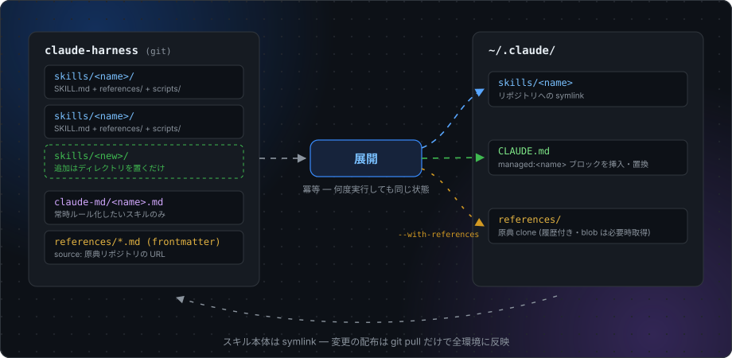

# claude-harness

Claude Code の個人グローバル設定 — スキルと CLAUDE.md の常時ルール — をここで一元管理する。`install.sh` を叩けば、どのマシンの `~/.claude` にも同じ状態が組み上がる。



## 収録スキル

| スキル | 用途 | 起動 |
|---|---|---|
| `harness-design` | LLM ハーネス・プロンプト設計の参照資料集 (原典 8 本)。蒸留版 → 原典 clone の 2 層で読む | 自動 |
| `ui-design` | UI 生成のデザイン参照資料集 (原典 3 本: DESIGN.md 雛形 / アンチスロップ規律 / デザイントークン仕様)。同じ 2 層 | 自動 |
| `avoid-ai-slop-ja` | 日本語文章から AI 臭 (slop) を除くレビュー・リライトの手法 | 自動 |
| `avoid-ai-slop-design` | Web UI・スライド・図解・生成画像の AI 臭検出カタログと処方 (計測研究・学術ソースの出典付き) | 自動 |
| `claude-harness-refs-update` | 参照資料 (蒸留版と原典 clone) の鮮度チェックと再蒸留。更新機構の所有者 | `/claude-harness-refs-update` |

「自動」はスキルの `description` に合致した作業で Claude Code が自分で読み込む。更新スキルだけは明示起動専用 (`disable-model-invocation`)。

## 導入

前提は git・bash・Claude Code。

```bash
git clone https://github.com/ystk-kai/claude-harness.git ~/claude-harness
~/claude-harness/install.sh --with-references
```

`--with-references` を外すと原典 clone (合計数百 MB) を取らない。蒸留版だけでも参照スキルは動くが、索引から原典の該当ファイルを読む経路が使えなくなる。`~/.claude` 以外に展開する環境は `CLAUDE_CONFIG_DIR` を設定して実行する。

### Claude Code に任せる

新しい環境の Claude Code に次を貼ると、clone から検証まで実行してくれる。

```text
https://github.com/ystk-kai/claude-harness を ~/claude-harness に clone し、
~/claude-harness/install.sh --with-references を実行してください。
完了後に次の 3 点を検証して結果を報告してください:
1. ~/.claude/skills/ に skills/ 配下の 5 スキルへの symlink があること
2. ~/.claude/CLAUDE.md に managed:harness-design ブロックが挿入されていること
3. bash ~/claude-harness/skills/claude-harness-refs-update/scripts/check-freshness.sh --offline
   が全リポジトリ OK を返すこと
```

## 仕組み

管理対象は 3 種類。

- `skills/<name>/` — スキル本体 (SKILL.md + 必要に応じて references/・scripts/)
- `claude-md/<name>.md` — グローバル CLAUDE.md に常時挿入するルール (必要なスキルのみ)
- `install.sh` — 冪等な展開スクリプト。何度実行しても同じ状態に収束する

`install.sh` は 3 つのことをする。

1. **skills を symlink する** — `skills/*/` を `~/.claude/skills/<name>` へ張る。symlink でない実体が既にある場合は上書きせず、警告してスキップする (手動で退避してから再実行)
2. **CLAUDE.md にルールを差し込む** — `claude-md/*.md` を `<!-- BEGIN managed:<name> -->` 〜 `<!-- END managed:<name> -->` で囲んで `~/.claude/CLAUDE.md` へ。既存の同名ブロックは位置を問わず取り除き、ファイル末尾に貼り直す。手書き部分は触らない
3. **原典を clone する (`--with-references` 指定時のみ)** — 各スキルの `references/*.md` の frontmatter にある `source` URL を `~/.claude/references/<repo>/` へ `git clone --filter=blob:none` で取得する。blob は必要時取得だが履歴は完全なので、鮮度チェックの差分表示がそのまま動く

`--with-references` は第 1 引数のときだけ効く (`install.sh --foo --with-references` は無視される)。clone 済みのディレクトリは再取得しない — 原典の更新は `/claude-harness-refs-update` の仕事。

`--with-references` の実行ごとに、clone 済みのものも含めて `.claude/skills` を worktree から外す (sparse-checkout)。原典を置いただけで第三者のスキルがディレクトリスコープで自動登録されるのを防ぐため。中身が必要なら `git -C <clone> show HEAD:.claude/skills/...` で読める。`.claude/{agents,commands,hooks,settings.json,rules}` は入れ子では自動ロードされないので残してあり、実例として読める。

スキル本体は symlink なので、内容の変更は `git pull` だけで全環境に反映される。`install.sh` の再実行が要るのは、スキルを追加・改名したときと `claude-md/` を変えたときだけ。

## 参照資料の 2 層構成

原典リポジトリの実体はこのツリーに含めず、蒸留版 frontmatter の `source` URL から clone して復元する。

- **蒸留版** — `skills/{harness-design,ui-design}/references/*.md`。要点と索引を 250 行以内にまとめたもの。`source` が repo リストの唯一の正、`distilled_commit` が蒸留時点の原典 SHA
- **原典** — `~/.claude/references/<repo>/`。全文。蒸留版と食い違ったら原典が正
- **更新機構** — `skills/claude-harness-refs-update/` が一元所有する。`scripts/check-freshness.sh` が検出、`DISTILLING.md` が構成規約と再蒸留の手順、`scripts/frontmatter.sh` は `install.sh` と共用のパーサ

鮮度チェックは `bash skills/claude-harness-refs-update/scripts/check-freshness.sh`。origin を fetch して BEHIND (clone が upstream より古い) と STALE (蒸留版が clone より古い) を差分コミット付きで報告し、要対応があれば exit 1 を返す。`--offline` で fetch を省略できる。

チェックから更新まで一括で回すなら `/claude-harness-refs-update` — 鮮度チェック → BEHIND の `git pull` → STALE の再蒸留を順に実行する。`--check` でチェックのみ、repo 名を渡すとその repo だけを対象にする。更新の入口はこのコマンド 1 つに集約してある。

参照リポジトリを増やすときは、蒸留版を `skills/<skill>/references/<clone ディレクトリ名>.md` として 1 ファイル作り、そのスキルの SKILL.md の表に行を足す。`check-freshness.sh` と `install.sh` はどちらも `skills/*/references/*.md` をスキル横断で走査するので、置き場所が合っていれば自動で対象になる。詳しい規約は [DISTILLING.md](skills/claude-harness-refs-update/DISTILLING.md)。

## スキルを増やす・外す

増やすとき:

1. `skills/<name>/SKILL.md` を書く (Agent Skills 標準の構成: SKILL.md + 必要に応じて references/・scripts/)。memory などの外部状態に依存させず `references/` で自己完結させる。外部依存が避けられない場合は frontmatter の `compatibility` に書く
2. 常時ルール化したいスキルだけ `claude-md/<name>.md` を足す
3. `install.sh` を再実行する

外すとき・改名するときは手動の掃除が要る。`install.sh` は消えたスキルの symlink も、消えた `claude-md/` の managed ブロックも刈らない。`rm ~/.claude/skills/<旧名>` と CLAUDE.md の該当ブロック削除を自分でやってから再実行する (改名後の残骸は dangling symlink になる)。

## 設計メモ: 原典 clone をスキルディレクトリ内に置かない理由

[Agent Skills 標準](https://agentskills.io/specification) の `references/` は、そのスキルのために書かれた focused な文書を置く場所と定義されている。一方ここで扱う原典は外部リポジトリの丸ごと clone (数百 MB・第三者ライセンス・`git pull` で独立に更新) で、性質が違う。そのため:

- 外部 clone (生データ) は共有コーパスとして `~/.claude/references/` に外出しする。スキル配布時に第三者リポジトリを同梱せずに済み、CLAUDE.md ルールや他スキルからも共有できる
- スキル外パスへの依存は SKILL.md の `compatibility` フィールド (標準仕様の宣言用フィールド) で明示する
- 自作の蒸留資料は標準どおり `skills/<skill>/references/` に置き、SKILL.md から 1 階層でリンクする。通常の参照は蒸留版で完結させ、原典の全文走査による入力トークンの肥大化を避ける
